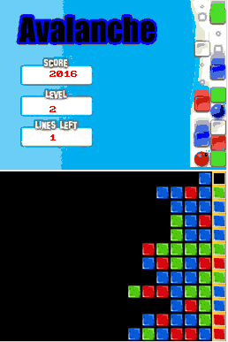
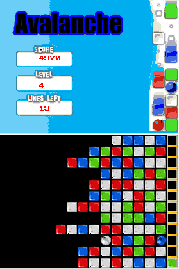
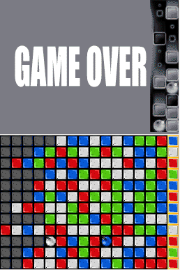

# nds-games

This repository includes nintendo ds games written using devkitpro.

To facilitate building the following docker image is used: [werner/devkitpro](https://hub.docker.com/r/werner/devkitpro/)

To build use the following:

    make

The generated nintendo ds rom can then be played using an emulator (DeSmuME):

    desmume-glade avalanche/source.nds
